# Telas
# Telas

## 1. Organização da Arquitetura
projeto-mobile/
 
 ```text

 wireframes/
   ├── Home (tela_01.png) 
   ├── Categoria Específica (tela_02.png)
   ├── Destaques (tela_03.png)
   ├── Painel Administrativo: Categorias (tela_04.png)
   ├── Painel Administrativo: Criar Post (tela_05.png)
   ├── Painel Administrativo: Criar Post (tela_06.png)
   ├── Painel Administrativo: Escolhas do Editor (tela_07.png)
   ├── Painel Administrativo: Usuários (tela_08.png)
   ├── Painel Administrativo: Fila de Revisão (tela_09.png)
   ├── Painel Administrativo: Fila de Comentários (tela_10.png)
   ├── Resultados da Busca (tela_11.png)
   ├── Entrar (Login) (tela_12.png)
   ├── Criar Conta (Cadastro) (tela_13.png)
   └── Perfil do Usuário (tela_14.png)
```
## 2. Protótipo das Telas
### 1. Tela 01 — Página Inicial (Home)
- **Função:** Principal porta de entrada da aplicação. Reúne navegação principal, busca rápida, chamada para assinatura de newsletter, categorias populares e todas as categorias em grid/carrossel, postagens em destaque e a curadoria de "Escolhas do Editor".
- **Componentes Identificados:** `navigation-bar`, `search-box`, `banner-hero`, `tag-list`, `card--featured`, `card--compact`, `footer-nav`.

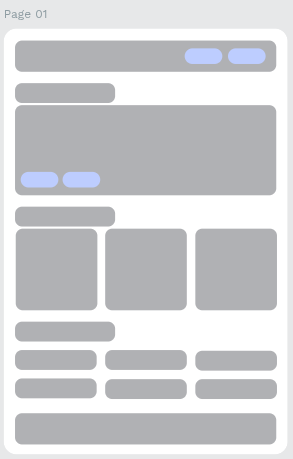

---

### 2. Tela 02 — Categoria Específica (ex: Techno)
- **Função:** Exibe a listagem de artigos e matérias filtradas por uma categoria temática. Permite a ordenação por filtros (Popular, Mais recentes, Produtividade) e possui ação de paginação contínua ("Carregar mais").
- **Componentes Identificados:** `header-category`, `filter-chips`, `card-grid`, `card--standard`, `button--secondary`, `footer-nav`.

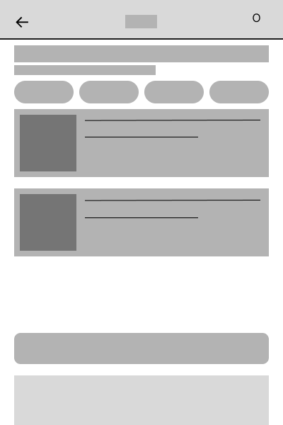

---

### 3. Tela 03 — Destaques
- **Função:** Área focada nas postagens que receberam maior relevância editorial dentro da plataforma. Demonstra o reuso sistemático dos cards de conteúdo em formato vertical responsivo.
- **Componentes Identificados:** `header-title`, `card-grid`, `card--featured`, `footer-nav`.

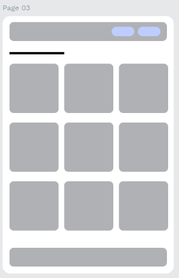

---

### 4. Tela 04 — Assinatura de Newsletter
- **Função:** Interface dedicada à captura de leads e assinantes da newsletter periódica. Apresenta formulário simples com campo de e-mail, aceite dos termos de privacidade e botão de confirmação.
- **Componentes Identificados:** `form--newsletter`, `form__input`, `form__checkbox`, `button--primary`.

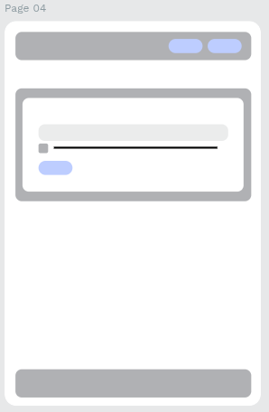

---

### 5. Tela 05 — Painel Administrativo: Categorias
- **Função:** Gerenciamento das categorias de conteúdo do portal. Contém indicadores numéricos de desempenho no topo (posts, visualizações, inscritos, pendências), barra de pesquisa e lista/tabela de categorias com ações diretas de "Editar" e "Excluir".
- **Componentes Identificados:** `admin-metrics`, `admin-menu`, `search-input`, `data-table`, `button--compact`, `button--danger`.

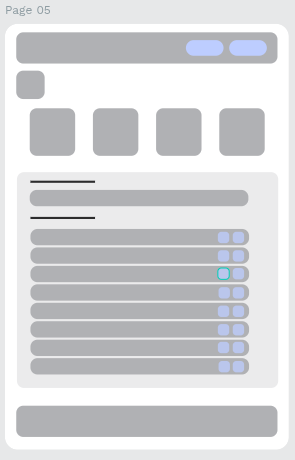

---

### 6. Tela 06 — Painel Administrativo: Criar Post
- **Função:** Formulário para redação e submissão de novos artigos. Permite inserir título, corpo de texto (editor), seleção de categorias/tags e upload de thumbnail. Possui três ações de fechamento: "Salvar rascunho", "Enviar para revisão" ou "Publicar".
- **Componentes Identificados:** `form--post`, `form__editor`, `form__file-upload`, `button-group` (`button--secondary`, `button--outline`, `button--primary`).

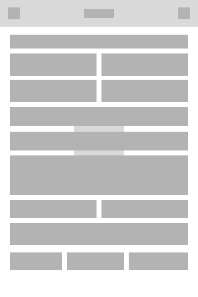

---

### 7. Tela 07 — Painel Administrativo: Escolhas do Editor
- **Função:** Curadoria dos artigos destacados que aparecerão na tela inicial. Lista os artigos ativos e permite agendar exibições ou remover itens da lista de destaques.
- **Componentes Identificados:** `admin-metrics`, `admin-menu`, `search-input`, `data-table`, `button--outline`.


---

### 8. Tela 08 — Painel Administrativo: Usuários
- **Função:** Gestão de usuários cadastrados no sistema. Apresenta listagem de contas, seus respectivos status (ex.: Ativo, Bloqueado) e botões de ação para moderação e controle de acesso ("Bloquear" / "Desbloquear").
- **Componentes Identificados:** `admin-metrics`, `admin-menu`, `data-table`, `badge--status`, `button--action`.

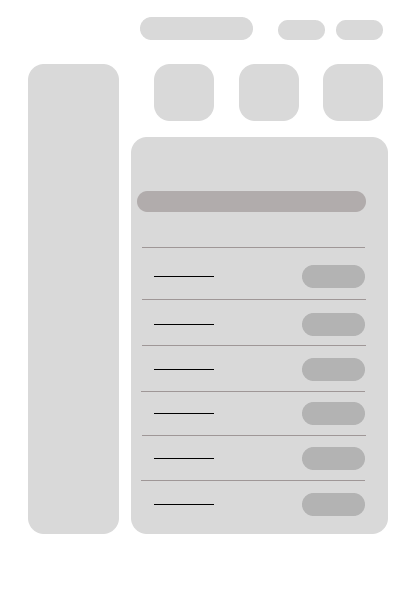

---

### 9. Tela 09 — Painel Administrativo: Fila de Revisão
- **Função:** Moderação de publicações enviadas por autores antes da publicação oficial. Apresenta o título da postagem, o autor, status "Em revisão" e botões rápidos para "Aprovar" ou "Reprovar".
- **Componentes Identificados:** `admin-metrics`, `admin-menu`, `data-table`, `button--success`, `button--danger`.


---

### 10. Tela 10 — Painel Administrativo: Fila de Comentários
- **Função:** Painel de moderação para comentários submetidos pela comunidade. Lista comentários pendentes de avaliação com autoria e possibilita sua aprovação ou reprovação em lote ou individualmente.
- **Componentes Identificados:** `admin-metrics`, `admin-menu`, `data-table`, `button--success`, `button--danger`.

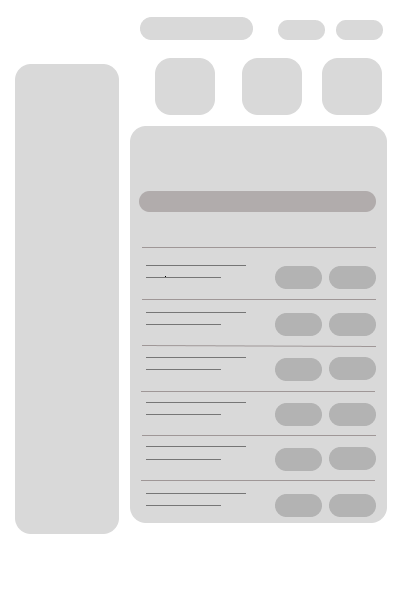

---

### 11. Tela 11 — Resultados da Busca
- **Função:** Tela de retorno da pesquisa realizada pelo usuário. Exibe resultados em formato de cards horizontais compactos, contendo miniatura de imagem, título correspondente, categoria e data de postagem.
- **Componentes Identificados:** `header-search`, `card--horizontal`, `card__meta`, `footer-nav`.

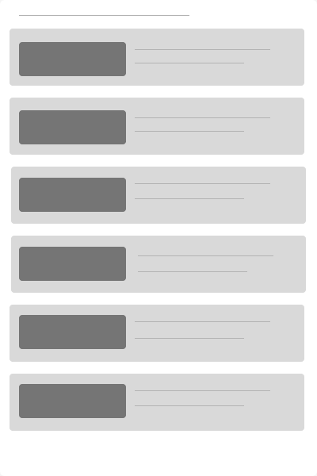

---

### 12. Tela 12 — Entrar (Login)
- **Função:** Autenticação de usuários cadastrados com e-mail e senha, botão de autenticação social ("Entrar com Google") e links de recuperação de senha ou redirecionamento para novo cadastro.
- **Componentes Identificados:** `form--auth`, `form__input`, `button--primary`, `button--social`, `link--inline`.

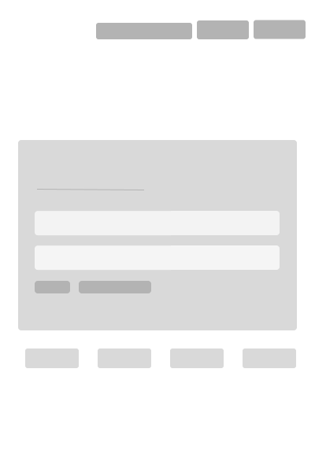

---

### 13. Tela 13 — Criar Conta (Cadastro)
- **Função:** Formulário de registro para novos usuários. Coleta nome completo, e-mail, senha e confirmação de senha, incluindo checkbox obrigatório de concordância com termos e política de privacidade.
- **Componentes Identificados:** `form--auth`, `form__input`, `form__checkbox`, `button--primary`.

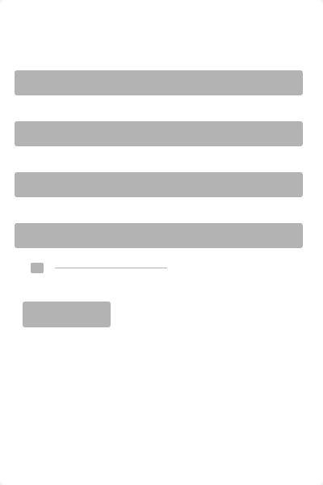

---

### 14. Tela 14 — Perfil do Usuário
- **Função:** Gestão de informações pessoais (nome, biografia, avatar) e visualização de postagens e comentários vinculados à conta do usuário, indicando visualmente os estados de cada conteúdo (Rascunho, Em análise, Publicado).
- **Componentes Identificados:** `profile-header`, `form--profile`, `status-badge` (`status--draft`, `status--pending`, `status--published`), `card--compact`, `button--primary`.

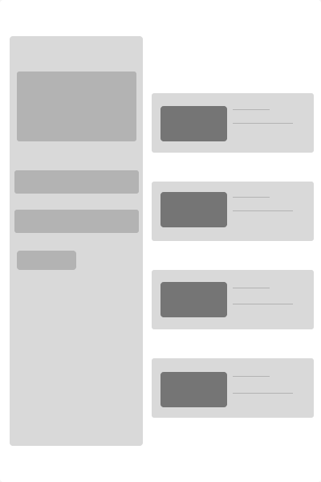

---